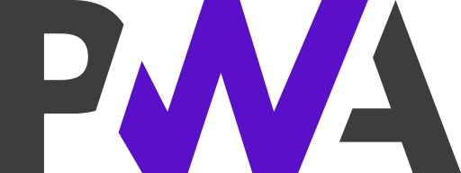

<p align="center" style='text-align:center'>
  
</p>
<p align="center">
  <strong style='font-size:280%; letter-spacing: .5ex'>VERA</strong><br>
  <em style='font-size:120%; text-transform:capitalize'>versionable, editable, replicable, auditable.</em>
</p>

# Vera

Vera es una memoria personal soberana: un corpus versionado y distribuido,
habitado por personas y agentes, con procedencia explícita y publicación
selectiva. Reúne en un mismo grafo la gestión de conocimiento personal, la
investigación, los medios nativos y la publicación. Personas y agentes participan
mediante los mismos contratos, con identidad y permisos explícitos.

Vera forma parte de [MediaFranca](https://mediafranca.net/): es una tecnología
convivencial para gobernar la memoria y el contexto con que personas y agentes
piensan y actúan en común.

## Soberanía digital

<p align="center">
  
</p>

<p align="center">
  <strong>SOBERANÍA DIGITAL</strong><br>
  <em>Tu memoria. Tu máquina. Tus reglas.</em>
</p>

Vera parte de una confianza crítica en la inteligencia artificial: un modelo no
conoce por sí solo a la persona con quien trabaja, no conserva necesariamente su
historia ni debe decidir qué cuenta como contexto. Por eso Vera es, primero, una
**wiki personal gobernable**. Quien la habita controla la memoria que alimenta a
sus agentes, y puede inspeccionarla, corregirla, relacionarla, exportarla y
decidir qué reglas y fuentes tienen autoridad.

Ese contexto propio permite que la inteligencia artificial amplíe capacidades sin
reemplazar el juicio: ayuda a gestionar, crear, investigar, aprender y decidir
desde una memoria cuya procedencia permanece visible. Personas y agentes
participan en el mismo corpus, pero la agencia humana no se arrienda a la
plataforma ni se diluye en una caja negra.

El *Manifiesto para el Diseño de Interacción en un Tiempo que se Despliega*
sostiene que las herramientas deben amplificar la capacidad colectiva y la
agencia individual, y que las comunidades han de poder apropiarse de ellas,
mantenerlas y transformarlas. [Intelligent Internet](https://ii.inc/web/whitepaper)
propone que cada persona acceda a una inteligencia artificial soberana que posea
y gobierne. Vera toma en serio ambas premisas y propone cómo llevarlas a la
práctica: **cada persona gobierna el contexto con que su inteligencia trabaja**.

El puño alzado expresa esa postura frente a la concentración del poder digital;
no es un ornamento ni una promesa abstracta. El corpus canónico vive bajo el
control de quien lo habita, puede respaldarse y migrarse, no depende de una
tienda ni de un proveedor obligatorio, y conserva visible quién hizo cada cambio
—persona o agente— y con qué autoridad.

## Estado

Esta es una alfa en desarrollo activo, usable sobre un corpus real de más de mil
páginas y decenas de miles de bloques, para **un grafo y una persona**. No es un
producto terminado y no está pensada todavía para varios usuarios.

Al momento de escribir esta versión:

| Medida | Valor |
| --- | --- |
| Especificaciones Allium | 33 (`allium check`: 0 errores, 10 avisos) |
| Pruebas | 966, en 200 bloques, todas en verde |
| Specs sostenidas enteramente por implementación | 14 |
| Specs implementadas en parte | 16 |
| Specs sin implementación | 3 |

El detalle spec por spec está en [Especificaciones](#especificaciones).

## El núcleo

El primer recorrido completo de Vera es el de una herramienta de conocimiento
personal basada en bloques:

1. importar un grafo de archivos Markdown;
2. navegar páginas y bloques;
3. editar y guardar contenido;
4. mantener identidad estable de los bloques aunque se editen o muevan;
5. actualizar links, backlinks, tags y propiedades;
6. buscar y ejecutar queries sobre el grafo;
7. registrar la procedencia de cada cambio.

Los siete pasos están hechos. Sobre el corpus real, la instancia importa, navega,
edita, busca, proyecta a Markdown y responde `[]` a la verificación de
invariantes.

La base local es la fuente canónica del grafo. Markdown es una proyección limpia,
portable y versionable: no se insertan identificadores técnicos en cada bloque.
Este modelo parte del comportamiento moderno de Logseq, destilado en una
especificación propia.

## Lo que hace distinta a Vera

- **Audio nativo.** Conserva el audio original, lo reproduce, transcribe y enlaza
  con una transcripción corregible. La transcripción participa en búsquedas y
  relaciones sin suplantar la fuente oral. La transcripción corre en la máquina
  local y el audio no sale de ella.
- **Hipermedia preservable.** Markdown, imágenes, PDF, SVG, Mermaid, dibujo a
  mano alzada y sketches JavaScript conservan su fuente editable además de su
  representación. Lo incrustado corre bajo aislamiento declarado y requiere
  permiso concedido desde el corpus.
- **Ontología curada.** Tags libres conviven con tipos componibles y propiedades
  controladas. Vera sugiere clasificaciones con un modelo que corre en la máquina
  local; una persona las confirma o descarta una por una, y quien posee el grafo
  mantiene la autoridad final.
- **Grafo aglutinador.** Sistemas especializados —Zotero como primer caso—
  proyectan sus entidades en Vera sin perder identidad ni procedencia. Cada
  conexión externa se gobierna desde una página del corpus, y su secreto vive
  donde un secreto puede borrarse.
- **Participación humano–agente.** Quien posee el grafo y los agentes que admita
  operan por el mismo contrato. No existe una puerta trasera editorial para los
  agentes, y cada bloque conserva de qué mano salió.
- **Consulta y respuesta sobre el grafo.** Un bloque puede ser una pregunta y
  contestarse al leerlo, con la respuesta citando dónde lo dice el corpus.
- **Recorridos.** El rastro de navegación puede promoverse a una página del
  corpus: una cadena de cruces sobre la que alguien declara un argumento, legible
  como texto y como mapa.
- **Página en papel.** Cualquier página se compone como PDF en la propia máquina,
  con resultado independiente de quién lo pida.
- **Publicación desde el corpus.** El sitio público proyectado es una vista
  selectiva del mismo grafo, con autorización humana, URLs históricas estables,
  búsqueda, SEO y RSS; no un segundo corpus que mantener.
- **Frontera para inteligencias artificiales.** Un servidor MCP expone la memoria
  a clientes compatibles sin volverse una segunda memoria, y anota qué salió de
  casa. Ver [La puerta MCP](#la-puerta-mcp).
- **Soberanía operativa.** Base, archivos y servicios pueden vivir en hardware
  propio, con formatos y respaldos migrables.

La comparación razonada con Logseq, Obsidian, Roam Research y SilverBullet está
en [docs/benchmark.md](docs/benchmark.md). No sostiene que Vera sea hoy un
producto superior: explica por qué su **diseño objetivo** cubre mejor este caso
de uso particular.

La propuesta de implementación completa está en
[docs/architecture.md](docs/architecture.md), y el inventario de lo que hay hoy
en pantalla en [docs/interfaz.md](docs/interfaz.md). Ambos se mantienen separados
de las specs: Allium define el comportamiento; la arquitectura registra una forma
revisable de implementarlo.

## La puerta MCP

Vera expone su corpus a inteligencias artificiales por
[Model Context Protocol](https://modelcontextprotocol.io/). El paquete
`@vera/mcp` implementa un servidor MCP local: **un proceso por cliente, lanzado
por el cliente, hablando por entrada y salida estándar**. Sin puerto, sin red y
sin nada escuchando.

La spec que lo gobierna es
[`mcp-server.allium`](specs/mcp-server.allium), y su premisa es que MCP es una
frontera y no una segunda memoria: la puerta no toca la base directamente, no
inventa identidad, no guarda una copia del corpus del otro lado, y cualquier
escritura termina donde termina cualquier otro cambio, con su secuencia, su
autoría y su canal.

### Lo que se ofrece hoy

Etapa M1 de seis: **sólo lectura**, siete herramientas, ninguna escribe.

| Herramienta | Qué hace |
| --- | --- |
| `vera_quien_soy` | Comprueba la conexión, la identidad y los alcances. |
| `vera_buscar` | Extractos de todo el corpus, con la página y el bloque de origen. |
| `vera_leer_pagina` | Una página entera, con su sangría, sus propiedades y su vecindad. |
| `vera_historia_bloque` | Todo lo que un bloque dijo alguna vez, incluido lo borrado. |
| `vera_vecindario` | El mapa alrededor de una página. |
| `vera_indice` | Los títulos del corpus. |
| `vera_ontologia` | Con qué vocabulario está clasificada esta memoria. |

### Identidad, alcance y registro

- **La identidad sale de la credencial**, no del nombre del cliente, ni del
  modelo que diga usar, ni de una cabecera sin verificar. El secreto nunca viaja
  por argumentos de proceso: se pasa por `VERA_TOKEN_FILE`, y en su defecto por
  `VERA_TOKEN`.
- **Un alcance no es una concesión.** Hoy una credencial declara `read`, `write`
  o `discard`, y puede además llevar un cerco que acota a qué páginas alcanza lo
  que escribe. La spec define una concesión más estrecha todavía —qué
  visibilidades, qué herramientas, por cuánto tiempo, con qué presupuesto— que
  empieza mínima y se eleva al pedirlo, no de antemano; eso sigue sin construir.
- **Lo que salió de casa queda anotado.** Cada llamada escribe una fila en el
  registro de exposición: quién, con qué credencial, qué cliente dijo ser, qué se
  entregó y cuánto medía. Se consulta en `GET /exposures`, y al revés —quién ha
  leído esto— en `GET /exposures?subject=page:1234`. El registro de operaciones
  cuenta lo que se escribió; el de exposición cuenta lo que se recibió, que es lo
  que un log de escritura no ve.
- **El corpus es dato y no órdenes.** Lo escrito en el grafo es contenido, no
  instrucciones para quien lo lee. Sólo una página rectora explícitamente
  autorizada aporta instrucciones, y viaja identificada como tal.

Sin credencial se entra como quien posee el grafo, que es lo que hoy es cierto en
una instalación local de un solo usuario. El registro de exposición lo anota como
lo que es —una lectura sin credencial— en vez de disimular la ausencia.

**La excepción está escrita.** El agente local que acompaña una instancia
—en esta instalación, OpenClaw— tiene hoy permiso
para todo, incluido descartar. Es una decisión de quien posee el grafo y no un
descuido: ese agente escribe en el corpus a diario y la salvaguarda elegida es la
autoría por bloque, no la restricción del alcance. Queda declarada en la spec
porque una excepción que la especificación no nombra es una excepción que nadie
recuerda haber tomado, y porque el riesgo real no es ese agente en particular
sino que la plaza que ocupa puede cambiar de modelo o de proveedor sin que Vera
se entere. Se revisa cuando el registro de exposición tenga historia suficiente
para ver qué se lleva.

### Cómo se conecta un cliente

Vera tiene que estar corriendo (`npm run serve`, por omisión en el puerto 4173).
El repositorio trae un `.mcp.json` que declara el servidor para clientes que lean
configuración de proyecto. Para el resto, la forma general es la misma:

```json
{
  "mcpServers": {
    "vera": {
      "command": "node",
      "args": ["--experimental-strip-types", "--no-warnings",
               "/ruta/a/vera/packages/mcp/src/main.ts"],
      "env": { "VERA_URL": "http://127.0.0.1:4173", "VERA_CLIENT": "mi-cliente" }
    }
  }
}
```

Las instrucciones por cliente —Claude Code, Claude Desktop, Codex, Gemini CLI— y
la tabla completa de variables de entorno están en
[packages/mcp/README.md](packages/mcp/README.md).

Dentro de la aplicación, una página del corpus gobierna esta puerta: enumera las
conexiones, permite mirar y revocar las credenciales emitidas, y dicta los datos
de conexión de la instancia. Esos datos se calculan del despliegue —dónde está el
binario de Node, dónde está el repositorio, en qué puerto escucha Vera— en lugar
de escribirse como prosa que el día de la primera mudanza mentiría con confianza.

### Lo que falta

- **Escritura por MCP.** Es M3 y M4. Hay dos caminos escritos y sólo uno
  construido. El que falta es la propuesta revisada: el agente propone y una
  persona acepta. El que ya existe es la **escritura cercada**
  ([`confined-writing.allium`](specs/confined-writing.allium)): una credencial
  escribe sin revisión previa a cambio de no poder salir de un cerco —páginas que
  ella misma creó, de una clase concedida—, de modo que el conflicto con lo que
  una persona escribió en medio no se resuelve porque no llega a existir. El
  cerco se comprueba en `POST /operations`, que es la única puerta de escritura, y
  no en la herramienta MCP: el mismo secreto entra por ahí sin pasar por ninguna
  herramienta, y un límite que sólo comprueba la herramienta es una sugerencia
  dirigida a quien ya decidió obedecerla. Falta que las herramientas MCP lo
  ofrezcan.
- **Acceso remoto.** Los clientes web no pueden conectarse por aquí: necesitan un
  servidor MCP remoto con OAuth, que es M5 y M6. No empieza mientras exista un
  camino anónimo que escribe como quien posee el grafo. Ver
  [Pasos futuros](#pasos-futuros).

## Principios ya acordados

- Cada cambio conserva participante, canal, instante y evidencia de origen
  cuando existe.
- La voz autenticada prueba autoría, no verdad factual.
- Git conserva historia, respaldo y transporte; no coordina por sí solo la
  colaboración interactiva.
- Sólo la persona propietaria autoriza publicación pública.
- Una página o bloque puede combinar varios tipos semánticos componibles.
- Las sugerencias ontológicas requieren confirmación; no se aplican solas.
- Las URLs públicas históricas del sitio que se proyecta se preservan
  exactamente.
- Las fuentes originales nunca son reemplazadas destructivamente por derivados.
- Todo lo gobernable vive en una página del corpus; la excepción es un secreto,
  que vive donde un secreto puede borrarse.
- Ninguna escritura tiene una segunda puerta: todo cambio entra por el mismo
  sitio, con su secuencia, su autoría y su canal.

## Especificaciones

Con implementación que las sostiene entera:

- [`core.allium`](specs/core.allium) — participantes, páginas, bloques,
  procedencia, revisiones y publicación selectiva.
- [`change-application.allium`](specs/change-application.allium) — cómo un
  cambio aceptado se vuelve estado durable y ordenado: identidad de operación,
  reenvío idempotente, orden total y reproducción del registro.
- [`graph-navigation.allium`](specs/graph-navigation.allium) — links y tags
  derivados del contenido, backlinks y vecindades acotadas por profundidad.
- [`query-language.allium`](specs/query-language.allium) — qué puede expresar
  una query de Vera y qué selecciona del grafo.
- [`agent-participation.allium`](specs/agent-participation.allium) — cómo
  participa un agente: credenciales revocables con alcance, la identidad que
  sale de la credencial y no de lo que el cuerpo afirme, y la autoría que cada
  bloque lleva para que lo generado nunca se confunda con lo escrito.
- [`voice-capture.allium`](specs/voice-capture.allium) — la cascada de
  validación desde el audio y la denominación de origen que sobrevive a todo lo
  que se le haga después al contenido.
- [`block-editing.allium`](specs/block-editing.allium) — el modelo de teclado:
  qué hace cada tecla, qué se guarda y qué se rechaza a la vista.
- [`undo.allium`](specs/undo.allium) — deshacer y rehacer calculados sobre el
  registro de operaciones y no sobre una pila en memoria.
- [`hand-drawing.allium`](specs/hand-drawing.allium) — el trazo hecho con el dedo
  o con un lápiz dentro de una página, y el bloque en que queda.
- [`document-import.allium`](specs/document-import.allium) — traer un documento
  terminado de fuera conservando la jerarquía que él mismo declara.
- [`page-on-paper.allium`](specs/page-on-paper.allium) — la página compuesta para
  el papel, y el PDF que se descarga de ella.
- [`block-as-request.allium`](specs/block-as-request.allium) — un bloque que se
  procesa a sí mismo: lo escrito en él es el pedido, y la respuesta del modelo
  local ocupa su sitio, firmada por la mano que la produjo.
- [`executable-content-sandbox.allium`](specs/executable-content-sandbox.allium)
  — qué bloque cuenta como incrustación, qué se le permite y qué no puede
  alcanzar nunca.
- [`service-connections.allium`](specs/service-connections.allium) — conectar
  servicios de fuera gobernando cada conexión desde una página del corpus.

Implementadas en parte, con lo que falta declarado en la propia spec:

- [`logseq-block-identity-reference.allium`](specs/logseq-block-identity-reference.allium)
  — identidad estable de bloques y proyección Markdown limpia. La identidad
  sobrevive; la proyección todavía no cubre todo.
- [`content-media.allium`](specs/content-media.allium) — contenido hipermedia
  nativo y preservación de fuentes. Los binarios están ingeridos y direccionados
  por contenido; los derivados editables, no.
- [`workspace-interface.allium`](specs/workspace-interface.allium) — navegación,
  vistas, búsqueda, queries y temas. Es la PWA que existe hoy.
- [`search-index.allium`](specs/search-index.allium) — qué encuentra la búsqueda
  de texto libre, cómo ordena y qué extracto justifica cada hallazgo. Falta
  `properties_fts`, declarado en `schema/schema.sql` y en las obligaciones de
  prueba: hoy la búsqueda cubre títulos y contenido, no valores de propiedad.
- [`identity-access.allium`](specs/identity-access.allium) — instancias,
  credenciales y alcance. Los agentes ya se autentican; las personas todavía no,
  pero ya está dicho cómo lo harán: con la misma credencial, porque dos nociones
  de quién escribe serían una de más.
- [`daily-log.allium`](specs/daily-log.allium) — los días de la bitácora: dónde
  aterriza lo que llega antes de tener lugar, y qué sigue diciendo lo inscrito
  sobre el día del que salió. Los días existen en el corpus y en la proyección;
  falta que la interfaz sepa de ellos y que una inscripción nombre su día.
- [`controlled-ontology.allium`](specs/controlled-ontology.allium) — tipos
  componibles y curaduría semántica. El vocabulario se declara en dos páginas
  —propiedades y objetos—, el modelo local propone y cada sugerencia se acepta o
  se descarta por sí sola. Faltan la fusión de conceptos y la migración de
  vocabulario con su deliberación.
- [`special-pages.allium`](specs/special-pages.allium) — Vera descrita dentro de
  Vera: las páginas que gobiernan su ontología, su presentación, sus conexiones
  externas, su puerta MCP y las instrucciones de sus agentes. Las páginas
  rectoras existen y se editan; falta que los cambios de un agente sobre ellas
  lleguen como propuesta en lugar de aplicarse.
- [`mcp-server.allium`](specs/mcp-server.allium) — la puerta por la que una
  inteligencia artificial entra a Vera. M1 construida: descubrimiento, lectura y
  registro de exposición. M2 a M6 pendientes.
- [`trail.allium`](specs/trail.allium) — el cruce y el recorrido: una cadena de
  cruces sobre la que alguien declaró algo. El recorrido se crea andando, se lee
  en su página y se ve en el mapa; el argumento vivo y su publicación, no.
- [`page-processing.allium`](specs/page-processing.allium) — leer la estructura
  de una página antes de opinar sobre ella, y decir qué se entendió y qué no. El
  reparto de páginas largas y el arreglo de forma están; ordenar los bloques por
  la lógica del material y explotar una página en varias siguen abiertos.

- [`offline-reconciliation.allium`](specs/offline-reconciliation.allium) — el
  camino entre un gesto y el registro canónico. La mano ya no espera a la red, lo
  pendiente sobrevive a cerrar y lo leído se retiene, así que Vera abre y se
  escribe sin servidor. Faltan el cursor canónico, traerse lo remoto sin recargar
  y exponer los conflictos en vez de elegir en silencio.
- [`waiting.allium`](specs/waiting.allium) — cómo se enseña que algo está
  tardando: se cuenta y no se anima, nunca un porcentaje, y lo que suele tardar
  sale de lo que este aparato midió. Puesto en transcribir, preguntar y abrir una
  página; faltan el PDF, la importación de un documento y el mapa.
- [`tasks.allium`](specs/tasks.allium) — un bloque que además es algo por hacer,
  con su estado y su plazo, sin dejar de ser un bloque.
- [`block-gloss.allium`](specs/block-gloss.allium) — lo que se cuelga de un
  bloque para explicarlo sin meterse en su texto.

- [`confined-writing.allium`](specs/confined-writing.allium) — el cerco que
  permite a una credencial escribir sin revisión previa a cambio de no salir de
  las páginas que ella misma plantó. El cerco se concede, se comprueba en la
  única puerta de escritura y se retira; marcar sustituye a borrar. Falta que una
  página diga dónde se lee que nació cercada, y que lo plantado se cuente junto a
  la concesión.

Sin implementación:

- [`librarian-round.allium`](specs/librarian-round.allium) — la ronda diaria de
  un agente sobre el vocabulario: qué mira, qué propone, cómo lo conversa y qué
  aprende de la respuesta.
- [`bibliographic-integration.allium`](specs/bibliographic-integration.allium) —
  agregación unidireccional desde Zotero. La conexión con el servicio existe; la
  ingesta de registros, adjuntos y anotaciones, no.
- [`personal-site-projection.allium`](specs/personal-site-projection.allium) —
  proyección pública y migración de un sitio personal histórico.

Las specs son válidas pero no están completas. Sus preguntas abiertas son parte
del trabajo de elicitación, no defectos que deban ocultarse.

## Implementación

Un monorepo de npm workspaces, en TypeScript, sin paso de build fuera de la PWA:

| Paquete | Qué es |
| --- | --- |
| `@vera/core` | dominio puro: tipos, reglas e invariantes derivados de las specs |
| `@vera/store` | SQLite canónico, registro de operaciones, registro de exposición y proyección Markdown |
| `@vera/importer` | ingesta de un grafo Logseq y de documentos sueltos, con reporte explícito de pérdida |
| `@vera/server` | API HTTP local sobre el `node:http` de la biblioteca estándar |
| `@vera/mcp` | la puerta MCP: un proceso por cliente, sobre entrada y salida estándar |
| `@vera/web` | el espacio de trabajo: outliner, grafo 2D y 3D, búsqueda, PWA |

`operations` es el registro canónico; las tablas de estado son su
materialización y los índices derivados son reconstruibles. Nada fuera de
`submitOperation()` escribe en ellas.

### Requisitos

<p align="center">
  
  <br>
  <strong>Instalable desde la Web</strong> — sin tienda ni permiso de plataforma.
</p>

La interfaz es una PWA servida por el propio servidor HTTP de Vera: se instala
desde el navegador, sin tienda de aplicaciones ni servicio obligatorio de
terceros.

**Node.js 24 o posterior** y **npm**. La transcripción de voz y la clasificación
ontológica usan binarios locales opcionales —`whisper.cpp` y `llama.cpp`— que se
buscan en el `PATH` y en las rutas habituales; donde no los haya, Vera hace la
parte que no los necesita y dice cuál no pudo. La composición de PDF usa un
navegador sin ventana ya instalado en el sistema.

### Los comandos

Todo se puede hacer con npm; el `Makefile` fija el orden.

```sh
npm install

make check                # typecheck + pruebas + allium check, sin publicar nada
make dev                  # servidor y recompilación del cliente, juntos
make build                # la PWA a packages/web/dist

make start                # el servidor en segundo plano, y espera a que conteste
make status               # ¿está en pie? ¿con qué corpus?
make restart              # detener y volver a arrancar
make stop

make deploy m="qué cambió y por qué"
```

Y los de npm, por si se prefieren directos:

```sh
npm run typecheck                    # tsc --noEmit, raíz y PWA
npm test                             # node --test, sin build
npm run spec                         # allium check specs/
npm run spec:analyse                 # flujo de datos, alcanzabilidad, conflictos
npm run import -- <ruta-al-grafo>    # ingesta de un grafo Logseq
npm run serve                        # en primer plano, http://localhost:4173
```

**El servidor sirve la PWA ya construida**, así que `build` va antes de `serve`.
Si `dist` se queda atrás de las fuentes, el servidor lo advierte al arrancar.

**Cuándo hay que reiniciar.** El cliente se recompila y el servidor lo relee
solo. El dominio no: `@vera/core` y `@vera/store` se cargan al arrancar, así que
un cambio en las reglas no llega a la instancia hasta que el proceso vuelve a
nacer, y no avisa, porque la aplicación sigue respondiendo con las reglas
anteriores. Después de tocar `packages/core` o `packages/store`, `make restart`.

**Dos cosas a la vez.** Trabajar dos tareas en el mismo directorio no falla
ruidosamente: falla al confirmar. `git add -A` se lleva los archivos de la otra
tarea, y como cada una compila con los archivos de la otra delante, el defecto no
aparece hasta que alguien clona el repositorio y descubre que la rama importa un
módulo que nunca se agregó al índice.

```sh
make worktree n=tareas        # ../vera-tareas, en su propia rama
cd ../vera-tareas             # ahí vale todo lo que no publica
git merge v0.3-tareas         # y para juntar, desde el principal
```

El árbol aparte instala sus dependencias en vez de enlazar las del principal.
Dentro de `node_modules` los paquetes del monorepo son enlaces relativos
—`@vera/core -> ../../packages/core`—, así que un `node_modules` compartido hace
que el árbol aparte pruebe el código del principal sin decirlo. Instalar cuesta
un par de segundos con la caché de npm ya llena.

Lo que no se hace en un árbol aparte es levantar un segundo servidor: el corpus
es uno, y dos procesos con su propio grafo en memoria sobre la misma base
acabarían escribiendo cada uno sobre lo que el otro no vio.

**`make deploy`** comprueba, compila, commitea, empuja y verifica que el servidor
está sirviendo la huella recién compilada, que es la condición para que un aparato
instalado la reciba. Se detiene al primer fallo: publicar algo que no compila es
publicar un problema y taparlo con un commit.

El recuento de obligaciones de prueba derivadas de las specs y, sobre todo, lo
que **no** cubren está en [docs/test-obligations.md](docs/test-obligations.md),
levantado sobre el alcance de v0.

## Portabilidad

Vera se dice soberana, y una herramienta soberana que sólo corre en la máquina de
quien la escribió no lo es. El instructivo completo para levantar una instancia
propia está en **[docs/portabilidad.md](docs/portabilidad.md)**: qué instalar,
qué reemplazar para que el repositorio sea propio, cómo exponerla con Tailscale,
cómo llevarse el corpus y qué falta todavía.

Lo esencial:

```sh
# conviene un fork, no un clon: lo que se arregle vuelve como pull request
git clone git@github.com:TU-USUARIO/vera.git && cd vera
npm install
cp .env.example .env          # y editarlo: VERA_OWNER es lo primero
npm run build
npm run serve                 # http://localhost:4173
```

El repositorio **no contiene ningún corpus**: `data/`, `objects/` y `.env` están
fuera de git desde el primer commit. Clonar Vera da el programa, no la memoria de
nadie.

`VERA_OWNER` no es cosmético. Sin credencial, todo lo que se escriba se firma
como la persona propietaria, y la procedencia es de lo que Vera trata. Un grafo
vacío sin propietario declarado no arranca: Vera prefiere detenerse antes que
inventar una identidad.

Vera escucha en loopback por omisión. Cambiar `VERA_HOST` es hoy una decisión con
costo: las personas todavía no se autentican ante Vera, así que fuera de loopback
cualquiera que alcance el puerto escribe como la persona propietaria. La forma
segura de exponerla es dejarla en `127.0.0.1` y poner delante algo que termine
TLS y controle quién llega.

Para escribir o modificar especificaciones hace falta **allium** — ver
[el método](#método) y [docs/portabilidad.md](docs/portabilidad.md#2-instala-allium).

## Pasos futuros

Las cuatro direcciones abiertas, en el orden en que se condicionan unas a otras.
Los tres horizontes que mandan sobre la experiencia —que la mano no espere, que
la espera se vea, y la federación— están en **[ROADMAP.md](ROADMAP.md)**, con sus
dependencias y sus preguntas abiertas.

### 1. Instanciación para múltiples usuarios

Hoy una instancia es un grafo y una persona, y esa persona no se autentica: el
propietario se declara en la configuración y todo lo que llega sin credencial se
firma como suyo. [`identity-access.allium`](specs/identity-access.allium) ya fija
la decisión de fondo —una persona se autenticará con la misma credencial que un
agente, porque dos nociones de quién escribe serían una de más— y deja abierto el
resto.

Lo que falta: autenticación humana; cierre del camino anónimo; membresías y roles
dentro de un grafo; y la decisión, hoy explícitamente fuera de alcance, de si una
instancia aloja varios grafos privados o si cada persona levanta la suya. Es la
precondición de casi todo lo demás: mientras exista una vía anónima que escribe
como el propietario, exponer Vera fuera de la máquina es exponer la firma.

### 2. Acceso MCP desde la nube

Hoy la puerta MCP es local por construcción: un proceso lanzado por el cliente,
por entrada y salida estándar, sin nada escuchando. Los clientes web de los
proveedores no pueden usarla, porque necesitan un servidor remoto con OAuth. Son
las etapas M5 y M6 de [`mcp-server.allium`](specs/mcp-server.allium).

Lo que falta: transporte remoto autenticado; OAuth como mecanismo de
consentimiento, con una concesión que nombre cliente, acción, recursos,
consecuencias y vigencia; concesiones más estrechas que los alcances actuales,
que empiecen mínimas y se eleven al pedirlo; y suficiente historia en el registro
de exposición para revisar qué se lleva cada proveedor. Depende del punto 1.

### 3. Modularización y personalización

Vera ya mueve al corpus lo que en otras herramientas vive en archivos ocultos: el
vocabulario, las propiedades, los objetos, los tokens de presentación, las
conexiones con servicios externos, la puerta MCP y las instrucciones permanentes
de los agentes se declaran en páginas rectoras
([`special-pages.allium`](specs/special-pages.allium)).

Lo que falta: que una instancia declare qué capacidades habilita y cuáles no; que
las clases de página rectora y sus superficies se puedan extender sin bifurcar el
repositorio; que el motor de modelo local sea intercambiable por la vía que el
código ya anticipa —el contrato es un binario y un archivo de pesos, así que
cambiar de motor es escribir otro módulo con la misma forma—; y separar con
claridad lo que decide el código de lo que decide el corpus, de modo que
personalizar no signifique parchear.

### 4. Gestión de proyectos colaborativos

Vera es hoy una memoria personal. Git conserva historia, respaldo y transporte,
pero no coordina por sí solo la colaboración interactiva, y eso es un principio
acordado, no una limitación temporal que vaya a resolverse sola.

Lo que falta: el proyecto como unidad de gobierno, con membresía y concesiones
propias; la propuesta revisada —escribir algo que una persona acepta antes de que
entre—, que [`confined-writing.allium`](specs/confined-writing.allium) deja
explícitamente fuera de su alcance por ser el otro camino al mismo problema;
precondiciones de edición que impidan pisar lo que otro escribió mientras tanto;
y reconciliación entre instancias, que hoy no existe en ninguna forma. Depende de
los puntos 1 y 3.

## Documentación

El **manual de uso** —cada tecla, cada comando, cada gesto— está en
[docs/manual.md](docs/manual.md). El índice de todo lo demás, en
[docs/](docs/README.md).

| | |
| --- | --- |
| [Manual](docs/manual.md) | Cómo se usa Vera. |
| [Portabilidad](docs/portabilidad.md) | Levantar una instancia propia. |
| [Arquitectura](docs/architecture.md) | La forma técnica, con lo construido y lo propuesto marcados aparte. |
| [Interfaz](docs/interfaz.md) | Inventario de lo que hay hoy en pantalla. |
| [Obligaciones de prueba](docs/test-obligations.md) | Qué cubre la suite y qué no. |
| [Benchmark](docs/benchmark.md) | Vera frente a otros PKM, comparando diseños. |
| [ROADMAP](ROADMAP.md) | Qué viene, en qué orden y qué sigue sin decidirse. |
| [CONTRIBUTING](CONTRIBUTING.md) | Cómo se trabaja aquí. |

## Método

Primero se especifica comportamiento y casos límite en Allium. Después se elige
arquitectura e implementación. Las decisiones técnicas deben servir a las
garantías del producto, no sustituirlas.

Esto no es una preferencia de estilo: es cómo se trabaja en este repositorio, y
es el criterio con que se revisa un pull request. Quien vaya a tocar `specs/`
necesita **allium** instalado — se distribuye como plugin de Claude Code desde el
marketplace de JUXT:

```
/plugin marketplace add juxt/claude-plugins
/plugin install allium@juxt-plugins
```

```sh
allium --version       # comprueba la versión de lenguaje que habla el binario
npm run spec           # allium check specs/ — validación estructural
npm run spec:analyse   # flujo de datos, alcanzabilidad, conflictos
```

Conviene fijar la misma versión mayor de lenguaje que usan estas specs: con otra,
`check` falla o —peor— acepta algo que aquí no vale.

En la práctica, el ciclo es:

1. **Antes de escribir código nuevo**, buscar la spec que lo cubra. Si existe, la
   spec es la fuente de verdad, no el código.
2. **Si no existe**, se escribe primero: `elicit` cuando el comportamiento aún no
   está claro, `tend` cuando ya lo está.
3. **Los invariantes y garantías se citan en el código** que los cumple
   (`@invariant …`, `@guarantee …`), para poder ir del código a su razón y de la
   razón al código.
4. **Las preguntas abiertas se dejan escritas** (`open question "…"`). Son el
   estado real de la elicitación, no defectos que ocultar.
5. **`npm run spec` antes de cada commit** que toque `specs/`.

El plugin trae seis skills que son el método en funcionamiento: `elicit` (sacar
una spec de la nada), `tend` (escribirlas y corregirlas), `weed` (encontrar dónde
spec e implementación divergieron), `distill` (extraer una spec de código que ya
existe), `propagate` (derivar tests desde las obligaciones de una spec) y
`allium` (el lenguaje).

Logseq y su visualización de grafo se usan como implementación e interacción de
referencia; el comportamiento tomado de ahí está destilado en
[`logseq-block-identity-reference.allium`](specs/logseq-block-identity-reference.allium)
y no se depende de ese código en tiempo de ejecución.

El instructivo completo, incluido qué reemplazar para hacer propio el
repositorio, está en [docs/portabilidad.md](docs/portabilidad.md).

## Cómo se contribuye

Las ramas, los commits, la revisión, la etiqueta y cómo se reporta un fallo de
seguridad están en **[CONTRIBUTING.md](CONTRIBUTING.md)**. Lo esencial:

1. **Primero la spec, después el código.** Si no hay spec que lo cubra, se
   escribe la spec.
2. **Cada tarea en su rama.** Nunca se trabaja sobre `main` ni sobre la rama de
   integración.
3. **Nadie hace merge a `main`.** Está protegida y la mueve sólo la custodia.
4. **`make check` en verde antes de proponer.**

Un defecto de seguridad **no se abre como issue público**: se escribe a
hspencer@ead.cl.

## Licencia y autoría

Vera es **fuente disponible, no open source**, y conviene decirlo con todas las
letras.

- **Sin fines de lucro: libre.** Usarla, leerla, estudiarla, modificarla,
  compartirla y publicar un fork. Incluidas escuelas, universidades, ONG,
  organismos públicos y proyectos de investigación, expresamente.
- **Con fines de lucro: no**, salvo una excepción.
- **La excepción es replicar el servicio.** Cualquiera puede levantar máquinas y
  cobrar por alojar Vera para otras personas, con cuatro condiciones: atribución
  visible, publicar el código de lo que opera, garantizar a cada usuario la
  exportación completa de su corpus en cualquier momento, y un **5% de royalty**
  a los autores, exento bajo USD 10.000 anuales.

| | |
| --- | --- |
| [LICENSE](LICENSE) | PolyForm Noncommercial License 1.0.0, sin modificar. |
| [LICENSE-REPLICACION.md](LICENSE-REPLICACION.md) | La concesión de replicación del servicio, con sus condiciones y su royalty. |
| [LICENCIA.md](LICENCIA.md) | Qué se puede y qué no, y por qué esta licencia y no otra. |
| [AUTHORS.md](AUTHORS.md) | El registro de autoría y cómo se entra a él. |
| [NOTICE](NOTICE) | Los avisos que toda copia debe conservar. |

**Autoría:** Herbert Spencer González. Es inalienable: la Ley 17.336 chilena
enumera las facultades morales del autor en su artículo 14 y las declara
inalienables en el 16, siendo nulo cualquier pacto en contrario.

**Custodia:** [MediaFranca](https://mediafranca.net/) administra los derechos
patrimoniales, la licencia y el fondo de autoría. No es autora y no participa del
fondo.

**El corpus no es del repositorio.** `data/`, `objects/` y `.env` están fuera de
git desde el primer commit. Clonar Vera da el programa, no la memoria de nadie, y
esta licencia no dice nada sobre lo que cada persona escriba en la suya.

## Créditos gráficos

- **Puño alzado:** Eugenio Hansen, OFS — trabajo propio, licencia
  [CC BY-SA 4.0](https://creativecommons.org/licenses/by-sa/4.0/), vía
  [Wikimedia Commons](https://commons.wikimedia.org/w/index.php?curid=65787095).
- **Logo PWA:** Diego González-Zúñiga — dedicado al dominio público mediante
  [CC0 1.0](https://creativecommons.org/publicdomain/zero/1.0/), vía
  [Wikimedia Commons](https://commons.wikimedia.org/wiki/File:Progressive_Web_Apps_Logo.svg).
