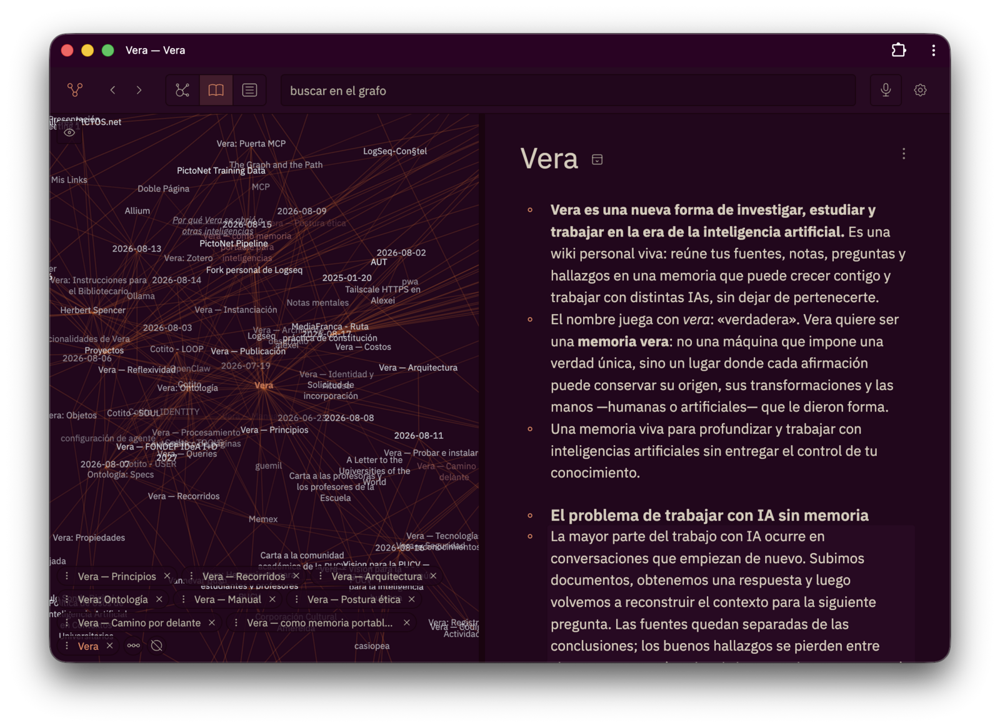

<p align="center">
  
</p>

# Vera

> **Una memoria viva para profundizar y trabajar con inteligencias artificiales
> sin entregar el control de tu conocimiento.**



Vera es una nueva forma de investigar, estudiar y trabajar en la era de la
inteligencia artificial. Reúne fuentes, notas, preguntas, medios y hallazgos en
una wiki personal que crece con cada lectura y cada conversación.

En un chat corriente, el contexto se reconstruye una y otra vez. En Vera, lo
aprendido permanece: las fuentes se conservan, las conclusiones se enlazan y una
pregunta puede convertirse en una página, un argumento o un nuevo recorrido de
investigación.[^llm-wiki]

Las inteligencias artificiales no miran esa memoria desde fuera. Participan en
ella como colaboradoras identificables: pueden investigar, transcribir,
resumir, relacionar y mantener; cada intervención conserva su procedencia y la
persona mantiene la dirección intelectual y la autoridad editorial.

## Qué permite hacer

- **Profundizar y documentar una investigación.** El texto, las fuentes y sus
  relaciones permanecen disponibles para continuar pensando, no sólo para
  contestar la pregunta del momento.
- **Desarrollar argumentos.** Los enlaces, contradicciones, preguntas y
  recorridos permiten pasar de una colección de notas a una posición razonada.
- **Trabajar con distintas IAs.** Una puerta común conecta clientes compatibles
  sin convertir a un proveedor en dueño de la memoria.
- **Delegar procesos.** Los agentes pueden ejecutar tareas de biblioteca y
  mantenimiento bajo identidad, permisos e historial explícitos.
- **Conservar objetos ricos.** Audio y transcripciones, imágenes, PDF, SVG,
  Mermaid, dibujos, HTML y sketches JavaScript viven junto al texto; los objetos
  ejecutables corren aislados.
- **Publicar sin duplicar.** Una página privada puede proyectarse selectivamente
  a la web desde el mismo corpus, con autorización humana.
- **Llevarse todo.** La base y los archivos viven en la máquina elegida; Markdown
  ofrece una proyección legible, versionable y migrable.

## Soberana, pero no aislada

La soberanía de Vera no consiste en guardar archivos en una isla. Consiste en
decidir dónde vive la memoria, quién puede leerla o transformarla, qué se publica
y cómo se abandona el sistema. El proyecto busca preservar agencia individual y
capacidad colectiva: una herramienta debe poder ser inspeccionada, apropiada,
mantenida y transformada por quienes dependen de ella.[^manifiesto]

Esa postura converge con la idea de una inteligencia personal abierta y
autogobernada,[^intelligent-internet] pero desplaza el centro desde «poseer una
IA» hacia **gobernar la memoria y el contexto con que distintas IAs trabajan**.
El modelo puede cambiar; el conocimiento, su historia y las decisiones sobre él
no deberían irse con el proveedor.

## No reinventar la wiki

Una wiki mantenida por agentes ya puede construirse con carpetas Markdown,
editores maduros, automatizaciones y modelos existentes. Vera adopta ese patrón;
no lo presenta como su invención.

La parte propia empieza donde ese patrón termina:

- autoría y procedencia verificables para personas y agentes;
- una memoria independiente de cualquier modelo o proveedor;
- argumentos y recorridos, no sólo resúmenes;
- publicación selectiva desde el corpus privado;
- colaboración y futura federación sin entregar el conjunto completo;
- automatización gobernada y reemplazable.

La regla de desarrollo es deliberadamente estricta: **reutilizar** herramientas
y estándares maduros, **conectar** capacidades mediante protocolos y extensiones,
y **construir** sólo el pequeño núcleo que sostiene ese contrato editorial. La
arquitectura de extensiones toma como referencia sistemas autoalojados donde el
núcleo puede seguir siendo pequeño y la comunidad añade capacidades mediante
*plugs*.[^silverbullet]

## Qué existe hoy

Vera es una **alfa de investigación** en desarrollo activo. Funciona sobre un
corpus real, pero está destinada por ahora a **una persona y un grafo**. No es un
servicio listo para producción ni una plataforma multiusuario.

El recorrido principal ya permite:

1. importar un grafo Markdown;
2. navegar, buscar, consultar y editar páginas y bloques;
3. conservar identidad estable, enlaces, propiedades e historial de cambios;
4. trabajar sin red sobre lo que ya está en el dispositivo y reconciliar después;
5. conectar agentes mediante MCP con identidad, alcance y registro de exposición;
6. capturar voz, importar documentos e incrustar medios;
7. proyectar páginas autorizadas a un sitio público.

Las decisiones abiertas —autenticación humana completa, sincronización entre
instancias, colaboración federada y un sistema estable de extensiones— están en
la [hoja de ruta](ROADMAP.md). La comparación con herramientas existentes y las
piezas que Vera debería reutilizar están en el [benchmark estratégico](docs/benchmark.md).

> [!WARNING]
> La aplicación privada escucha en loopback por omisión. No expongas directamente
> ese puerto a internet: las personas aún no se autentican ante Vera. Lee
> [Seguridad](SECURITY.md) y [Exponer Vera](docs/exponer-vera.md) antes de cambiar
> la frontera de red.

## Probar una instancia

Requiere Node.js 24 o posterior.

```sh
git clone https://github.com/hspencer/vera.git
cd vera
npm install
cp .env.example .env          # define VERA_OWNER y VERA_OWNER_NAME
npm run build
npm run serve                 # http://127.0.0.1:4173
```

Antes de escribir en una instancia propia, sigue la guía de
[portabilidad](docs/portabilidad.md): la identidad inicial determina quién firma
las operaciones del grafo. Para desarrollo también hacen falta el validador de
Allium y los pasos descritos en [CONTRIBUTING.md](CONTRIBUTING.md).

Comprobaciones del repositorio:

```sh
npm run spec
npm run typecheck
npm test
```

## Documentación

- [Manual de uso](docs/manual.md): escribir, enlazar, preguntar, navegar y usar
  medios.
- [Conectar una IA](docs/conectar-una-ia.md): clientes MCP, credenciales y
  límites actuales.
- [Portabilidad](docs/portabilidad.md): levantar, adaptar, respaldar y mover una
  instancia.
- [Exponer Vera](docs/exponer-vera.md): aplicación privada, publicación de
  lectura y acceso remoto.
- [Arquitectura](docs/architecture.md) y [diagramas](docs/diagramas.md): cómo se
  implementa y qué sigue siendo una propuesta.
- [Especificaciones Allium](specs/): el comportamiento que gobierna el proyecto.
- [Índice completo](docs/README.md): planes, pruebas, gobierno y referencias.

## Licencia, autoría y contribuciones

Vera se publica bajo [GNU AGPL-3.0-only](LICENSE). La explicación práctica está
en [LICENCIA.md](LICENCIA.md), el registro de autoría en [AUTHORS.md](AUTHORS.md)
y las reglas de contribución en [CONTRIBUTING.md](CONTRIBUTING.md). Los avisos de
recursos de terceros están en [NOTICE](NOTICE).

Vera forma parte de [MediaFranca](https://mediafranca.net/).

[^llm-wiki]: Andrej Karpathy, [“LLM Wiki”](https://gist.github.com/karpathy/442a6bf555914893e9891c11519de94f), 2026. El patrón propone compilar fuentes en un artefacto persistente que acumula conocimiento, en vez de reconstruirlo en cada consulta.
[^manifiesto]: Herbert Spencer, [“Manifiesto para el Diseño de Interacción en un Tiempo que se Despliega”](https://herbertspencer.net/2025/manifiesto), 2025.
[^intelligent-internet]: Emad Mostaque, [“Intelligent Internet Whitepaper”](https://webstatics.ii.inc/Intelligent-Internet-Whitepaper.pdf), 2025.
[^silverbullet]: [SilverBullet](https://silverbullet.md/) es una herramienta de notas Markdown autoalojada y programable mediante *plugs*; Vera la estudia como referencia de extensibilidad, no como algo que deba reproducir.
